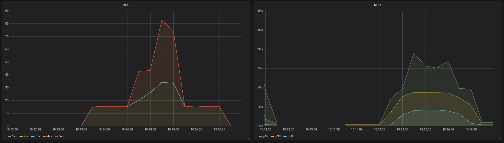
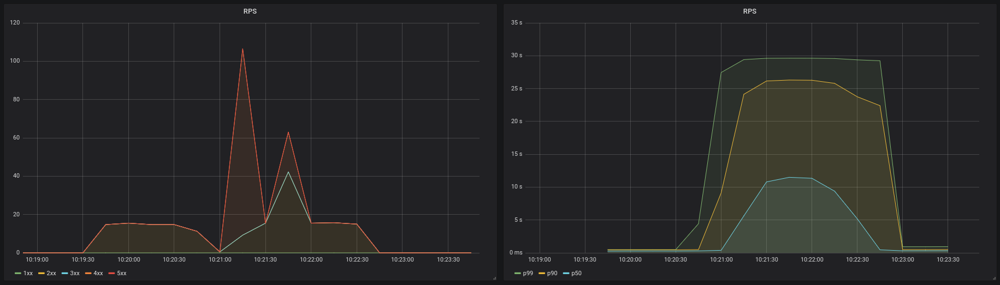

# Resilience demo

This demo is based on a talk ([slides here][slides]) about different server resilience patterns.

This resilience demo uses the library [goresilience][goresilience] to apply this patterns at the server side.

## Experiment 01 (naked server)

Good:

- Simple.

Bad:

- Collapse.
- Cascading failure.

## Experiment 02 (Bulkhead)

Good:

- Load shedding.

Bad:

- Static configuration.

## Experiment 03 (Bulkhead + circuit breaker)

Good:

- Load shedding.
- Fails faster than bulkhead (better latencies).
- Faster recovery of server than Bulkhead.

Bad:

- Static configuration.
- Miss request even the server is ok (until the CB realizes we are good again).

## Experiment 04 (CoDel)

Good:

- Load shedding.
- Server recovers very fast.
- New requests are served faster (unfair serving).

Bad:

- Needs a little bit of configuration (but doesn't affect too much).

## Experiment 05 (concurrency adaptive limit)

Good:

- Load shedding.
- Server recovers very fast.
- It adapts to any environment automatically (spikes, scaling, noisy neighbor...)

Bad:

- Depends on the load could be slow to adapt (depending on the environment it requires warming).

## Results for spike test

This results are for a group of different patterns that are stressed on the same kind of environment.

In this stress we will stress the server with the double of capacity that it can accept. The servers are ok with 15-25 requests (the average latency of a good requests should be `1s`).

This tests should show how the different patterns act when the latency of the server handles the of capacity.

Run with

```bash
docker run --rm -it -v $PWD:/src --network=host --memory="50m" --cpus="0.1"  golang:1.11 /src/bin/server --experiment N
```

Send traffic with:

```bash
echo "GET http://127.0.0.1:8000" | vegeta attack -rate=50/s -duration=1m | vegeta report
```

### exp 1

- Success [ratio] 31.67%
- Status Codes [code:count] 200:950 0:1603 503:447
- Latencies [mean, 50, 95, 99, max] 9.09326333s, 0s, 28.180106052s, 29.574287622s, 29.989903245s

### exp 2 (220 workers, 1s timeout)

- Success [ratio] 51.17%
- Status Codes [code:count] 200:1535 429:776 0:689
- Latencies [mean, 50, 95, 99, max] 12.930380008s, 13.435930045s, 27.965897573s, 29.563889997s, 29.959203303s

### exp 2 (60 workers, 1s timeout)

- Success [ratio] 57.77%
- Status Codes [code:count] 200:1733 429:1267
- Latencies [mean, 50, 95, 99, max] 4.5700287s, 4.285822451s, 8.256593014s, 10.321318012s, 12.401990449s

### exp 3 (220 workers, 1s timeout)

- Success [ratio] 40.43%
- Status Codes [code:count] 200:1213 429:1101 0:686
- Latencies [mean, 50, 95, 99, max] 12.57687717s, 12.847427793s, 27.929326512s, 29.619279806s, 29.991049583s

### exp 3 (60 workers, 1s timeout)

- Success [ratio] 41.60%
- Status Codes [code:count] 200:1248 429:1752
- Latencies [mean, 50, 95, 99, max] 2.583172117s, 2.392947835s, 6.548954219s, 7.609500836s, 9.196919811s

### exp 4 (220 workers)

- Success [ratio] 51.87%
- Status Codes [code:count] 429:1444 200:1556
- Latencies [mean, 50, 95, 99, max] 2.434703068s, 1.84255566s, 6.778619265s, 9.775439303s, 12.179703837s

### exp 4 (60 workers)

- Success [ratio] 53.27%
- Status Codes [code:count] 200:1598 429:1402
- Latencies [mean, 50, 95, 99, max] 1.762432259s, 1.44365169s, 4.36282489s, 5.979576587s, 8.201718358s

### exp 5 (timeout 1s)

- Success [ratio] 67.37%
- Status Codes [code:count] 200:2021 429:979
- Latencies [mean, 50, 95, 99, max] 3.209694967s, 2.628542629s, 7.328718577s, 9.713145382s, 12.767521878s

## Results for regular traffic and spike in the middle

This results are for a group of different patterns that are stressed on the same kind of environment.

In this stress we will stress the server with a regular RPS (15) of requets for 3m and in the middle of this 3m we will send the double of capacity (50rps) for 1m. The servers are ok with 15-25 requests (the average latency of a good requests should be `1s`).

This tests should show how the different patterns make our server acts and recovers from the sudden spike.

Run with

```bash
docker run --rm -it -v $PWD:/src --network=host --memory="50m" --cpus="0.1"  golang:1.11 /src/bin/server --experiment 1
```

Send traffic with:

```bash
sleep 65 && echo "GET http://127.0.0.1:8000" | vegeta attack -rate=50/s -duration=1m | vegeta report
```

then:

```bash
echo "GET http://127.0.0.1:8000" | vegeta attack -rate=50/s -duration=1m | vegeta report
```

### exp 1

#### 15RPS(3m)

- Success [ratio] 61.89%
- Status Codes [code:count] 200:1671 0:532 503:497
- Latencies [mean, 50, 95, 99, max] 2.51080016s, 262.903036ms, 15.855424962s, 24.749941401s, 29.625425221s


### exp 2 (220 workers, 1s timeout)

#### 15RPS(3m)

- Success [ratio] 67.93%
- Status Codes [code:count] 0:411 503:420 200:1834 429:35
- Latencies [mean, 50, 95, 99, max] 4.820603326s, 320.19943ms, 24.009952886s, 28.835446593s, 29.894011398s


### exp 2 (60 workers, 1s timeout)

#### 15RPS(3m)

- Success [ratio] 83.96%
- Status Codes [code:count] 200:2267 429:433
- Latencies [mean, 50, 95, 99, max] 1.696069548s, 335.811826ms, 6.531311434s, 8.563232968s, 12.107532162s



### exp 3 (220 workers, 1s timeout)

#### 15RPS(3m)

- Success [ratio] 69.33%
- Status Codes [code:count] 200:1872 0:93 429:735
- Latencies [mean, 50, 95, 99, max] 3.809694261s, 316.258491ms, 19.922584955s, 27.314762323s, 29.95229227s



### exp 3 (60 workers, 1s timeout)

#### 15RPS(3m)

- Success [ratio] 76.96%
- Status Codes [code:count] 200:2078 429:622
- Latencies [mean, 50, 95, 99, max] 1.110022864s, 323.719264ms, 5.271773142s, 7.541862776s, 9.79956623s


### exp 4 (220 workers)

#### 15RPS(3m)

- Success [ratio] 79.74%
- Status Codes [code:count] 200:2153 429:547
- Latencies [mean, 50, 95, 99, max] 1.736535205s, 335.867785ms, 8.842163205s, 14.767463182s, 19.481760476s


### exp 4 (60 workers)

#### 15RPS(3m)

- Success [ratio] 77.89%
- Status Codes [code:count] 200:2103 429:597
- Latencies [mean, 50, 95, 99, max] 830.401437ms, 328.131075ms, 3.139200682s, 5.418942909s, 8.5877377s


### exp 5 (timeout 1s)

#### 15RPS(3m)

- Success [ratio] 82.85%
- Status Codes [code:count] 200:2237 429:463
- Latencies [mean, 50, 95, 99, max] 1.524751115s, 332.292889ms, 7.043006583s, 10.687279027s, 13.078790153s


