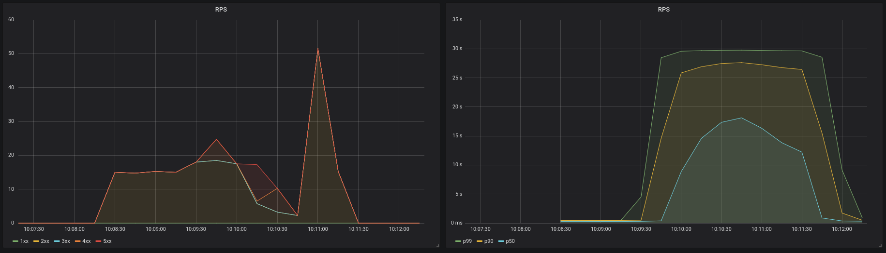
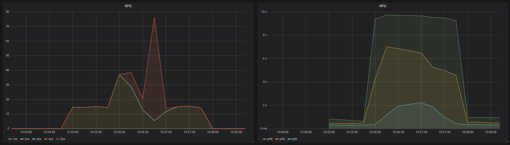
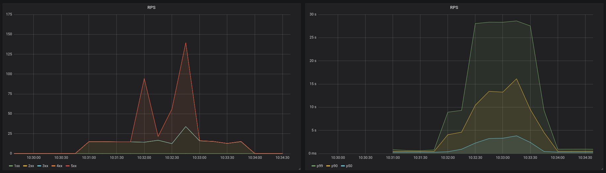
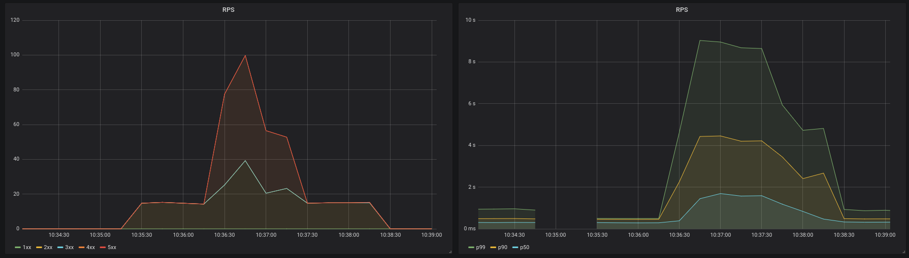
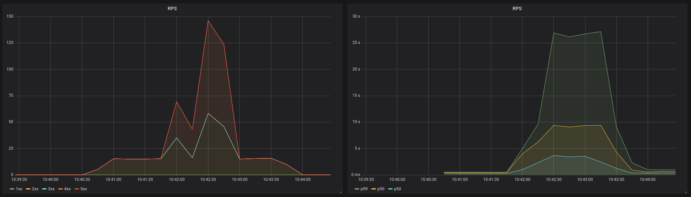

# Resilience demo

This demo is based on a talk ([slides here][slides]) about different server resilience patterns.

This resilience demo uses the library [goresilience] to apply this patterns at the server side.

## Run the stack

```
make stack
```

go to Grafana at http://127.0.0.1:3000

## Results for regular traffic and spike in the middle

This results are for a group of different patterns that are stressed on the same kind of environment.

In this stress we will stress the server with a regular RPS (15) of requets for 3m and in the middle of this 3m we will send the double of capacity (50rps) for 1m. The servers are ok with 15-25 requests (the average latency of a good requests should be `1s`).

This tests should show how the different patterns make our server acts and recovers from the sudden spike.

Run with

```bash
docker run --rm -it -v $PWD:/src --network=host --memory="50m" --cpus="0.1"  golang:1.11 /src/bin/server --experiment 1
```

Schedule traffic spike after ~65s with:

```bash
sleep 65 && echo "GET http://127.0.0.1:8000" | vegeta attack -rate=50/s -duration=1m | vegeta report
```

then start the regular traffic:

```bash
echo "GET http://127.0.0.1:8000" | vegeta attack -rate=15/s -duration=3m | vegeta report
```

### exp 1

#### 15RPS(3m)

- Success [ratio] 61.89%
- Status Codes [code:count] 200:1671 0:532 503:497
- Latencies [mean, 50, 95, 99, max] 2.51080016s, 262.903036ms, 15.855424962s, 24.749941401s, 29.625425221s


### exp 2 (220 workers, 1s timeout)

#### 15RPS(3m)

- Success [ratio] 67.93%
- Status Codes [code:count] 0:411 503:420 200:1834 429:35
- Latencies [mean, 50, 95, 99, max] 4.820603326s, 320.19943ms, 24.009952886s, 28.835446593s, 29.894011398s



### exp 2 (60 workers, 1s timeout)

#### 15RPS(3m)

- Success [ratio] 83.96%
- Status Codes [code:count] 200:2267 429:433
- Latencies [mean, 50, 95, 99, max] 1.696069548s, 335.811826ms, 6.531311434s, 8.563232968s, 12.107532162s


### exp 3 (220 workers, 1s timeout)

#### 15RPS(3m)

- Success [ratio] 69.33%
- Status Codes [code:count] 200:1872 0:93 429:735
- Latencies [mean, 50, 95, 99, max] 3.809694261s, 316.258491ms, 19.922584955s, 27.314762323s, 29.95229227s


### exp 3 (60 workers, 1s timeout)

#### 15RPS(3m)

- Success [ratio] 76.96%
- Status Codes [code:count] 200:2078 429:622
- Latencies [mean, 50, 95, 99, max] 1.110022864s, 323.719264ms, 5.271773142s, 7.541862776s, 9.79956623s



### exp 4 (220 workers)

#### 15RPS(3m)

- Success [ratio] 79.74%
- Status Codes [code:count] 200:2153 429:547
- Latencies [mean, 50, 95, 99, max] 1.736535205s, 335.867785ms, 8.842163205s, 14.767463182s, 19.481760476s



### exp 4 (60 workers)

#### 15RPS(3m)

- Success [ratio] 77.89%
- Status Codes [code:count] 200:2103 429:597
- Latencies [mean, 50, 95, 99, max] 830.401437ms, 328.131075ms, 3.139200682s, 5.418942909s, 8.5877377s



### exp 5 [AIMD] (timeout 1s)

#### 15RPS(3m)

- Success [ratio] 81.19%
- Status Codes [code:count] 200:2192 429:508
- Latencies [mean, 50, 95, 99, max] 1.090299079s, 333.604029ms, 4.439762406s, 6.628273028s, 8.179711014s



## Results for 15m of huge load

This test will send 60 RPS for 15m and see how it acts the server in high load (15-20 RPS is the regular load)

echo "GET http://127.0.0.1:8000" | vegeta attack -rate=60/s -duration=15m | vegeta report

### Exp 1

OOM

```
Requests      [total, rate]            54000, 60.00
Duration      [total, attack, wait]     15m14.268820372s, 14m59.983537578s, 14.285282794s
Latencies     [mean, 50, 95, 99, max]   5.732769857s, 991.749077ms, 24.422885044s, 28.789499333s, 29.992899254s
Bytes In      [total, mean]            1945752, 36.03
Bytes Out     [total, mean]            0, 0.00
Success       [ratio]                  9.62%
Status Codes  [code:count]             200:5196  0:14668  503:34136
Error Set:
Get http://127.0.0.1:8000: net/http: timeout awaiting response headers
503 Service Unavailable
```


### Exp 2

```
Requests      [total, rate]            54000, 60.00
Duration      [total, attack, wait]    15m2.553424497s, 14m59.983460652s, 2.569963845s
Latencies     [mean, 50, 95, 99, max]  4.920048256s, 4.489551134s 9.349859957s, 12.245651922s, 18.850354666s
Bytes In      [total, mean]            0, 0.00
Bytes Out     [total, mean]            0, 0.00
Success       [ratio]                  38.75%
Status Codes  [code:count]             200:20926  429:33074
```


### Exp 3

```
Requests      [total, rate]            54000, 60.00
Duration      [total, attack, wait]    15m3.046427769s, 14m59.98361661s, 3.062811159s
Latencies     [mean, 50, 95, 99, max]  2.552330289s, 2.301203189s, 6.615381322s, 8.104178217s, 12.29645732s
Bytes In      [total, mean]            0, 0.00
Bytes Out     [total, mean]            0, 0.00
Success       [ratio]                  29.65%
Status Codes  [code:count]             200:16013  429:37987
```


### Exp 4

```
Requests      [total, rate]            54000, 60.00
Duration      [total, attack, wait]    15m1.645409025s, 14m59.983690125s, 1.6617189s
Latencies     [mean, 50, 95, 99, max]  2.37438s, 1.870175413s, 6.238700461s, 8.340188889s, 13.108961085s
Bytes In      [total, mean]            0, 0.00
Bytes Out     [total, mean]            0, 0.00
Success       [ratio]                  29.07%
Status Codes  [code:count]             429:38300  200:15700
```


### Exp 5 [AIMD] (`ExecutionResultPolicy: concurrencylimit.NoFailurePolicy`)

```
Requests      [total, rate]            54000, 60.00
Duration      [total, attack, wait]    15m1.927478685s, 14m59.983671708s, 1.943806977s
Latencies     [mean, 50, 95, 99, max]  2.420665229s, 2.141484676s, 4.886248729s, 6.504374711s, 11.140164467s
Bytes In      [total, mean]            0, 0.00
Bytes Out     [total, mean]            0, 0.00
Success       [ratio]                  36.62%
Status Codes  [code:count]             200:19775  429:34225
```


### Exp 5b [AIMD] (`ExecutionResultPolicy: concurrencylimit.FailureOnRejectedPolicy`)

OOM

```
Requests      [total, rate]            54000, 60.00
Duration      [total, attack, wait]    14m59.983973922s, 14m59.98349615s, 477.772µs
Latencies     [mean, 50, 95, 99, max]  1.046654139s, 1.278223ms, 5.209302996s, 9.695038853s, 16.623353127s
Bytes In      [total, mean]            1803309, 33.39
Bytes Out     [total, mean]            0, 0.00
Success       [ratio]                  10.33%
Status Codes  [code:count]             200:5577  429:16786  503:31637

```


### Exp 5c [AIMD] (`ExecutionResultPolicy: concurrencylimit.FailureOnExternalErrorPolicy`)

OOM

```
Requests      [total, rate]            54000, 60.00
Duration      [total, attack, wait]    14m59.987470238s, 14m59.98353879s, 3.931448ms
Latencies     [mean, 50, 95, 99, max]  3.2162299s, 2.130500548s, 11.462128181s, 23.242654084s, 29.371690463s
Bytes In      [total, mean]            138339, 2.56
Bytes Out     [total, mean]            0, 0.00
Success       [ratio]                  33.09%
Status Codes  [code:count]             0:3  503:2427  200:17868  429:33702
```


[goresilience]: https://github.com/slok/goresilience
